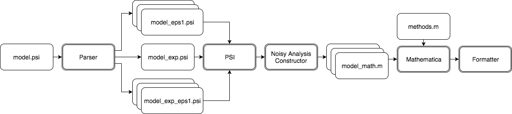

## Commmand Options

You can use the following options for PSense.  

| Command    | Type           | Description                            |
| ---------- | -------------- | -------------------------------------- |
| `-f`       | Required -f/-r | the PSI program to analyze sensitivity |
| `-r`       | Required -f/-r | the directory containing PSI programs  |
| `-verbose` | Optioned       | display all hiden information          |
| `-tp`      | Optioned       | set a time limit for PSI               |
| `-tm`      | Optioned       | set a time limit for Mathematica       |
| `-o`       | Optioned       | stream reasults to a specified file    |
| `-h`       | Optioned       | display the help informaiton           |

## PSense Workflow
