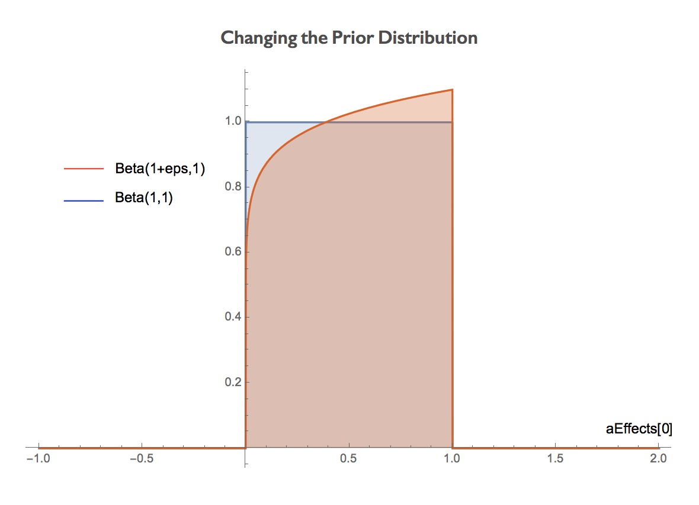


## Tutorial 2: Unknown Vending Machine

### Build Models in PSI

The following program models the behavior of an unknown vending machine with two buttons `a` and `b` selling only bagels and cookies. We do not know which button is for bagels, but we observe Sally, who wants a cookie, presses button `b`. Suppose Sally knows the how the machine works, how can we infer the probability that `b` gives bagels from Sally's action?

```{d}
a := 0;
b := 1;
actionPrior := [0.5, 0.5];
def vendingMachine(action: R, aEffects: R[], bEffects: R[]){
        if(action == a) {return categorical(aEffects);}
        else if(action == b){return categorical(bEffects);}
        else{return 2;}
}
def chooseAction(goal: R, aEffects: R[], bEffects: R[]){
        action := categorical(actionPrior);
        observe(goal == vendingMachine(action, aEffects, bEffects));
        return action;
}
def main(){
        aEffects := [beta(1,1), 0];
        bEffects := [beta(1,1), 0];
        aEffects[1] = 1-aEffects[0];
        bEffects[1] = 1-bEffects[0];
        goal := flip(0.5);
        observe(goal == 1 && sample(Marginal(chooseAction(goal, aEffects, bEffects)== b)));
        return bEffects[0];
}
```

Here is what the program does:

* In the `main` function, we set the prior distributions for two buttons's effects and Sally's goal:
```{d}
        aEffects := [beta(1,1), 0];
        bEffects := [beta(1,1), 0];
        aEffects[1] = 1-aEffects[0];
        bEffects[1] = 1-bEffects[0];
        goal := flip(0.5);
```
We don't know how button `a` and `b` works, so we suppose the probability that they give bagels follows a Beta distribution with two parameters $\alpha=1$ and $\beta=1$. `beta(1,1)` samples the probability that `a` gives bagel and is stored in `aEffects[0]`; the probability that `a` gives cookie would be  `1-aEffects[0]` and is stored in aEffects[1]. The same is for `b`. 
We suppose Sally's goal follows a Bernoulli distribution with 0.5 probability to be `bagel` (encoded as `0`) or `cookie` (encoded as `1`).

* If `a` is pressed, whether the vending machine gives bagel or cookie follows the probabilities stored in `aEffects`. We use `categorical(aEffects)` to sample bagel or cookie and return the result as what the vending machine releases. The result is encoded as `0` for `bagel` and `1` for `cookie`. The same is for `b`. If other buttons are pressed, return `nothing` (encoded as `2`).
```{d}
def vendingMachine(action: R, aEffects: R[], bEffects: R[]){
        if(action == a) {return categorical(aEffects);}
        else if(action == b){return categorical(bEffects);}
        else{return 2;}
}
```

* When Sally decides her action, she anticipates her action would allow the vending machine to release something that fulfills her goal. We can suppose Sally's action follows some prior distribution `actionPrior` and use `observe` to condition the fact that what the machine returns meets her goal.
```{d}
def chooseAction(goal: R, aEffects: R[], bEffects: R[]){
        action := categorical(actionPrior);
        observe(goal == vendingMachine(action, aEffects, bEffects));
        return action;
}
```

* Sally's behavior follows the distribution given by `chooseAction(goal, aEffects, bEffects) == b)`. We can model her pressing `b` by sampling from her behavior function `chooseAction`. The function `Marginal` around `chooseAction` gives the marginal distribution of Sally's behavior. The function `sample` samples from this distribution.  We `observe` the sampled result is equal to `b`. Also, we know Sally's goal is to get a cookie (`1`). Combining our knowledge about Sally together, we have:
```{d}
observe(goal == 1 && sample(Marginal(chooseAction(goal, aEffects, bEffects) == b)));
```

* Given these knowledge about Sally, we want to know what is the posterior distribution of pressing `b` giving bagel, so we `return bEffects[0]` in the `main` function.

* The result given by PSI in Wolfram Language is:
```
p[r1_] := -6/7*Boole[-1+r1<=0]*Boole[-r1<=0]*r1+10/7*Boole[-1+r1<=0]*Boole[-r1<=0]
```
which is the probability density function of the posterior of `bEffects[0]`. `r1` represents the value of `bEffects[0]`.

The code snippet can be found [here](https://github.com/yekerr/PSense/blob/master/examples/unknown_vending_machine.psi).
This model is modified from one example in [Probabilistic Models of Cognition (2nd Edition) Chapter 06](https://probmods.org/chapters/06-inference-about-inference.html). 

### Find Sensitivity with PSense


Notice that we suppose the probability that pressing the button giving bagels follows the distribution is given by `beta(1,1)`. There are two constant parameters `1` in the Beta distribution, changing which would give us different results.
We want to analyze the sensitivity of this program if we change the parameters of the prior. Specifically, we model the change with `?eps`. For example, we can change the first parameter of `aEffects[0]`'s prior by:

```{d}
        aEffects := [beta(1+?eps,1), 0];
        ...
```

The change in the prior distribution (when `?eps` = 0.1) is shown in the following figure. We want to know how does this change affects the output distribution.



PSense can automatically add `?eps` to each constant parameters and find the sensitivity of the probabilistic program. 
Run the following in shell prompt:
```{shell}
psense -f examples/continuous.psi
```

After changing the first parameter, PSense outputs:
```
Changed parameter 1 :
 Function Type:
Continuous
```

Then PSense gives the results for different metrics:

* Expectation Distance

     It is defined as $D_{Exp}=|\mathbb{E}[p_{eps}(r)]-\mathbb{E}[p(r)]|$, where
     $\mathbb{E}[p_{eps}(r)]$ and $\mathbb{E}[p(r)]$ are expectations of the output distributions with and without disturbance. After changing the first parameter, PSense genterates the symbolic expression for Expectation Distance as:
```
Expectation Distance
Abs[5/12 - (5 + eps)/(3*(4 + eps))]
```
PSense finds the maximum value of the Expectation Distance with respect to the disturbance `eps` within $\pm 10\%$ of the original parameter
```
Expectation Distance Max
{0.002032520325203291, {eps -> 0.1, r1 -> 6.4624724516972485}}
```
The result above shows the maximum value `0.00203` is obtained when `eps` $= -0.1$.
PSense further analyzes whether the distance grows linearly when the disturbance |`eps`| increases:
```
Is Linear?
False
```
In this example the Expectation Distance is not linear so PSense outputs `False`.

* Kolmogorov–Smirnov Statistic

    It is defined as $D_{KS}=\sup_{r\in support}|p_{eps}(r)-p(r)|$, where p_{eps}(r) and p(r) are the output cumulative density functions, and $\sup_{r\in support}$ represents the supremum of the distance over the support of $r$. PSense gives the distance $|p_{eps}(r)-p(r)|$ and the maximum value of $D_{KS}$, and then analyzes the linearity of $D_{KS}$.
```
Distance
Abs[(eps*(-1 + r1)*r1*Boole[r1 != 1])/(4 + eps)]/2
KS Distance Max
{0.0030487804878048764, {eps -> 0.1, r1 -> 0.49999998683698976}}
Is Linear?
False
```

* Total Variation Distance

    It is defined as $D_{TVD}=\frac{1}{2}\int_{r\in support}|p_{eps}(r)-p(r)|$ for continuous distribution.  PSense outputs the tightest linear upper and lower bound for the $D_{TVD}$ when the disturbance `eps` changes from 0 to 0.1:
```
TVD
 TVD Bounds(lower, upper):
2.5377672326760113*^-6 + 0.010136913218544538*eps
7.557631253843409*^-6 + 0.010136913218544538*eps
TVD Max
{0.0010162601626016266, {eps -> 0.09999999999999999}}
```


* See [Tutorial 1](tutorial_discrete_conditioning.html) for  metrics of discrete distributions.

### User Specified Disturbance

You can set a value for the disturbance `eps`.
Running the following to set `eps` to:

```{shell}
psense -f examples/unknown_vender_machine.psi -e 0.01
```
PSense would add `0.01` to each parameter in this program.
It outputs the following:
```
Changed parameter 1 :
 Function Type:
Continuous

Start All Metrics:
Expectation Distance
1/4812

KS Distance
{0.0003117206982543641, {r1 -> 0.5}}

TVD
0.00010390689941812139


Finish All Metrics
Changed parameter 2 :
...
```
Notice now that `eps` becomes a concrete value, PSense directly outputs the numerical distances instead of a symbolic expression containing `eps`. For KS statistic, PSense further outputs which $r1$ value results in the maximum value.

***
[Return to Homepage](index.html) | [Return to Tutorials](tutorial.html)
