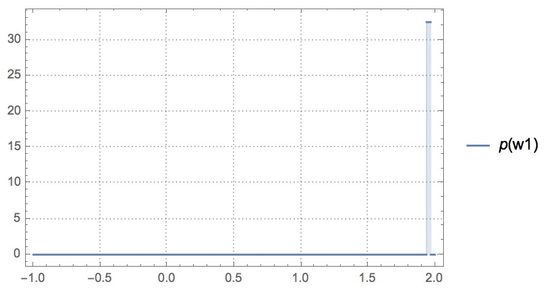
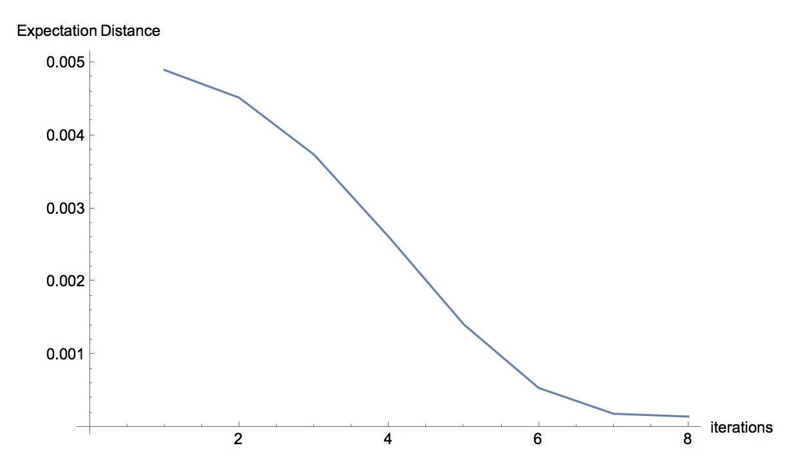

## Tutorial 4: Modeling Conditional Distribution

### Build Models in PSI

The following program implements the gradient descent algorithm:
```{d}
def main(){
  x := [1,2,3,4,5,6,7,8,9,10];
  y := [2,4,6,8,10,12,14,16,18,20];
  w1 := 0;
  w2 := uniform(0, 1);
  a := 0.01;
  for t in [0..4){
    i := t;
    xi := x[i];
    yi := y[i];
    w1 = w1 - a*2*(w1+w2*xi-yi);
    w2 = w2 - a*2*(xi*(w1+w2*xi-yi));
  }
  return w2;
}
```

Here is what the program does:

* `x` and `y` are two arrays that store observed data. The data comes from the function $y = 2x$.
```{d}
  x := [1,2,3,4,5,6,7,8,9,10];
  y := [2,4,6,8,10,12,14,16,18,20];
```

* We want to fit a simple linear regression model $y_i = w_1 + w_2x_i$. To make the model simpler we set `w1` a concrete initial value and assume the initial distribution of `w2` follows a uniform distribution:
```{d}
  w1 := 0;
  w2 := uniform(0, 1);
```

* We set the learning rate `a` equal to 0.01. In each iteration we adjust the value of `w1` and `w2` so that the square error in the prediction moves against the gradient and towards the minimum. The algorithm is modified from [this example](https://en.wikipedia.org/wiki/Stochastic_gradient_descent#Example).
To make the model simpler, we only consider the prediction at a single value `xi` in each iteration.
```{d}
  a := 0.01;
  for t in [0..8){
    i := t;
    xi := x[i];
    yi := y[i];
    w1 = w1 - a*2*(w1+w2*xi-yi);
    w2 = w2 - a*2*(xi*(w1+w2*xi-yi));
  }
```
* Finally we want to find out the distribution of the parameter `w2` after 4 iterations.
```{d}
  return w2;
```

* The result given by by PSI in Wolfram Language is:
```
p[w2_] := 59604644775390625000000/1832427479823270972979*Boole[-117376862070957979027021/59604644775390625000000+w2<=0]*Boole[-w2+57772217295567354027021/29802322387695312500000<=0]
```
If we plot `p[w2_]` above, which is the probability density function of `w2`, we can see the value of `w2` approaches to 2:


The code snippet can be found [here](https://github.com/yekerr/PSense/blob/master/examples/gradient_descent.psi).

### Find Sensitivity with PSense

Notice that we initially suppose `w2` follows a Uniform distribution with support $w2\in [0,1]$ (`uniform(0,1)`).
We want to find out how the output distribution of `w2` changes if we perturb the parameter of the prior distibution. 

To estimate the change in the output distribution, we can add disturbance `?eps` to each of our prior `bernoulli(0.5)`. Conceptually, we may have:
```{d}
w2 := uniform(0+?eps, 1);     //Or, w2 := uniform(0, 1+?eps); 
```

Detailed definition of *Sensitivity* is in [Tutorial 1](tutorial_discrete_conditioning.html).

PSense can automatically add `?eps` to each constant parameters and find the sensitivity of the probabilistic program. 
Run the following in shell prompt:
```{shell}
psense -f examples/gradient_descent.psi
```

PSense would output the result for different metrics:

* Expectation Distance
    
$D_{Exp}=|\mathbb{E}[p_{eps}(r)]-\mathbb{E}[p(r)]|$, where
$\mathbb{E}[p_{eps}(r)]$ and $\mathbb{E}[p(r)]$ are expectations of the output distributions with and without disturbance. After changing the first parameter, PSense genterates the symbolic expression for Expectation Distance as:

```
Expectation Distance
Abs[232921296662092687081063/119209289550781250000000 + (-232921296662092687081063 - 1832427479823270972979*eps)/119209289550781250000000]
Expectation Distance Max
{0.00015371515816675618, {eps -> 0.01, r1 -> 6.482456327319131}}
Is Linear?
True
```
We can see the maximum value of the Expectation Distance is quite small. This is because after 8 iterations, the disturbance in the prior has little effects on the output distribution. We can try different iterations in PSense and plot the iterations against the maximum value of the Expectation Distance as:




The more iterations the gredient descent algorithm take, the less likely that `eps` in the prior parameter affects the output. 

* Kolmogorov–Smirnov Statistic
    
$D_{KS}=\sup_{r\in support}|p_{eps}(r)-p(r)|$, where p_{eps}(r) and p(r) are cumulative density functions, and $\sup_{r\in support}$ represents the supremum of the distance over the support of $r$. PSense gives the distance $|p_{eps}(r)-p(r)|$ and the maximum value of $D_{KS}$, and then analyzes the linearity of $D_{KS}$.
```
Distance
Abs[115544434591134708054042 - 59604644775390625000000*r1 - 117376862070957979027021*Boole[59604644775390625000000*r1 >= 117376862070957979027021]*Boole[59604644775390625000000*r1 != 117376862070957979027021] + ((115544434591134708054042 + 1832427479823270972979*eps - 117376862070957979027021*Boole[59604644775390625000000*r1 >= 117376862070957979027021] - 59604644775390625000000*r1*Boole[59604644775390625000000*r1 != 117376862070957979027021])*(Boole[59604644775390625000000*r1 >= 117376862070957979027021] + Boole[115544434591134708054042 + 1832427479823270972979*eps <= 59604644775390625000000*r1]*Boole[59604644775390625000000*r1 != 117376862070957979027021]))/(-1 + eps)]/1832427479823270972979
KS Distance Max
{0.00990099009900715, {eps -> -0.01, r1 -> 1.9385139367333386}}
Is Linear?
False
```

* Total Variation Distance
    
It is defined as $D_{TVD}=\frac{1}{2}\int_{r\in support}|p_{eps}(r)-p(r)|$ for continuous distribution.  PSense outputs the tightest linear upper and lower bound for the $D_{TVD}$ when the disturbance `eps` changes from 0 to 0.1:
    
```
TVD
 TVD Bounds(lower, upper):
0.
0.
TVD Max
{0., {eps -> 0.01}}
```

Yes, after 8 iterations, the TVD approches 0. If we try only 4 iterations, we would get a TVD which is not zero, but still small:

```
TVD
 TVD Bounds(lower, upper):
0.00012002414692527094 + 0.008312669864717516*eps
0.0003681905898401973 + 0.008312669864717516*eps
TVD Max
{0.0009585091693914027, {eps -> 0.09}}
```

***
[Return to Homepage](index.html) | [Return to Tutorials](tutorial.html)